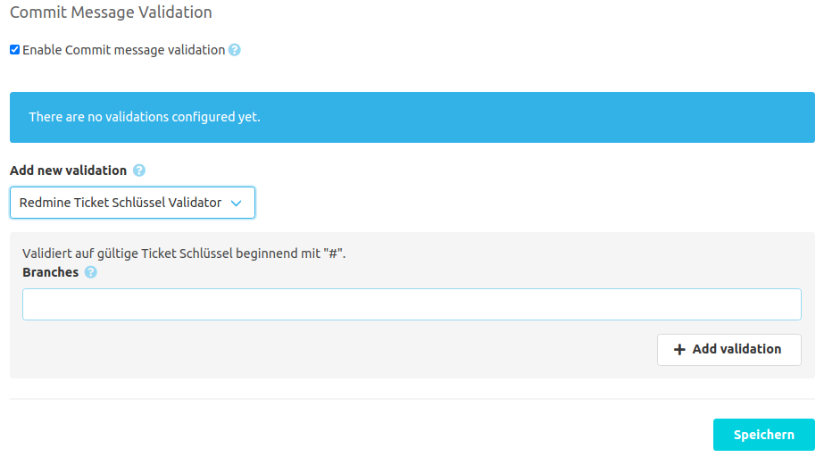

Wenn das [SCM-Commit-Message-Checker-Plugin](https://scm-manager.org/plugins/scm-commit-message-checker-plugin/) installiert wurde, 
liefert das Redmine Plugin einen eigenen Validator für Commit Nachrichten. Dieser Validator kann bei der Commit Nachricht Validierung konfiguriert werden.

# Validator Konfiguration
Der Redmine Ticket Schlüssel Validator überprüft sämtliche neuen Commits auf gültige Ticket Schlüssel. 
Dieser Validator kann auch nur auf einen definierten Satz von Branches angewandt werden. 
Wird kein Branch angegeben, werden alle Branches validiert.
Jeder neue Commit, welcher nicht einen gültigen Ticket Schlüssel enthält, wird vom SCM-Manager abgelehnt.

Beispiel gültige Commit Nachricht: `Neue Funktion #42`
Beispiel ungültige Commit Nachricht: `Fehler behoben`

