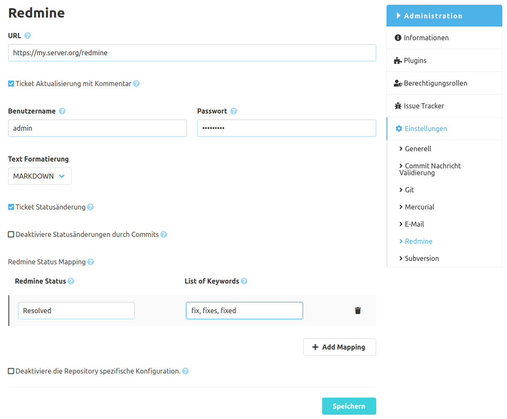

Wie im SCM-Manager 2 üblich, gibt es eine globale und eine repository-spezifische Konfiguration für das Redmine-Plugin. Die globale Konfiguration gilt für alle Repositories, die keine spezifische Konfiguration hinterlegt haben. Inhaltlich unterscheiden sich die Konfigurationen lediglich darin, dass in der globalen Konfiguration die repository-spezifische Konfiguration deaktiviert werden kann. 

### Konfigurationsformular
Für die Kommunikation zwischen dem SCM-Manager und Redmine muss zunächst zwingend die Redmine Instanz-URL inklusive Kontextpfad eingetragen werden.
Anschließend lässt sich bereits konfigurieren in welcher Form Redmine Tickets verändert / ergänzt werden sollen.

#### Kommentare erzeugen
Um Kommentare in Redmine zu erzeugen werden Zugangsdaten benötigt, welche einem technischen Redmine Benutzer gehören sollten.
Dieser Benutzer benötigt zudem ausreichende Berechtigungen, um Kommentare an existierenden Tickets zu erstellen ("Tickets anzeigen" & "Kommentare hinzufügen").
Des Weiteren muss die REST-Schnittstelle von Redmine aktiviert sein, die Einstellung befindet sich in Redmine unter `Administration->Konfiguration->API->REST-Schnittstelle aktivieren`.
Für die Kommentare lässt sich über ein Auswahl-Menü die Textformatierung einstellen, diese muss mit der verwendeten Formatierung in Redmine übereinstimmen (`Administration->Konfiguration->Allgemein->Textformatierung`).

Die Kommentare werden am Redmine Ticket erzeugt, sobald innerhalb einer Commit Nachricht die Ticket-ID erwähnt wurde. 

Beispiel Commit Nachricht: "#492 Add awesome new feature"

Damit wird ein Kommentar mit dieser Commit Nachricht am Redmine Ticket 492 erzeugt.

> **Wichtig:** Der konfigurierte Redmine Benutzer benötigt Berechtigungen, um den Status von Tickets zu ändern ("Tickets bearbeiten").

#### Ticket Status Aktualisierung
Um den Status eines Tickets über die Nachricht eines Commits zu ändern, kann eine Ticket-ID mit einem Redmine Status innerhalb eines Satzes verwendet werden.

Beispiel Commit Nachricht: "Bug #42 closed"

Das Beispiel setzt den Status des Tickets 42 auf "Closed".
Das setzt natürlich voraus, dass es den Status "Closed" in der angegebenen Redmine Instanz gibt.

Über die "Status Modifizierungswörter" lassen sich Wörter definieren, die anstelle des Redmine Status verwendet werden können.
Diese Schlüsselwörter kann man in Form einer kommaseparierten Liste angegeben.
Zum Beispiel könnte man für den Status "Closed" folgende Schlüsselwörter angeben: "closes, closing".
Damit würde die Commit Nachricht "Closes Bug #42" ebenfalls das Ticket 42 auf den Status "Closed" setzen.

Wenn Statusübergänge nur aufgrund von Pull Requests und nicht aufgrund von Commits durchgeführt werden soll, kann
zusätzlich die Option "Deaktiviere Statusänderungen durch Commits" aktiviert werden.

