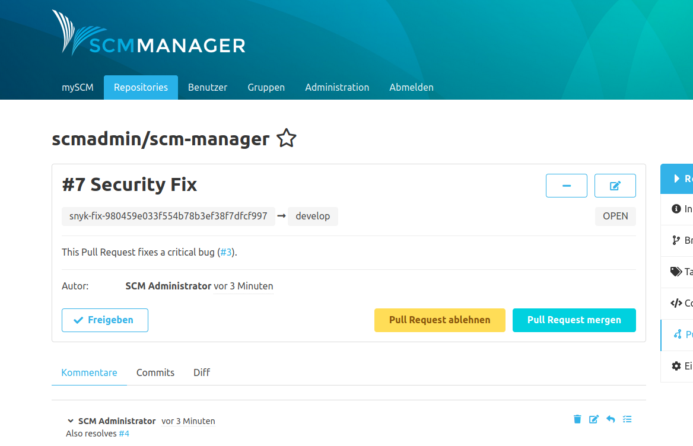
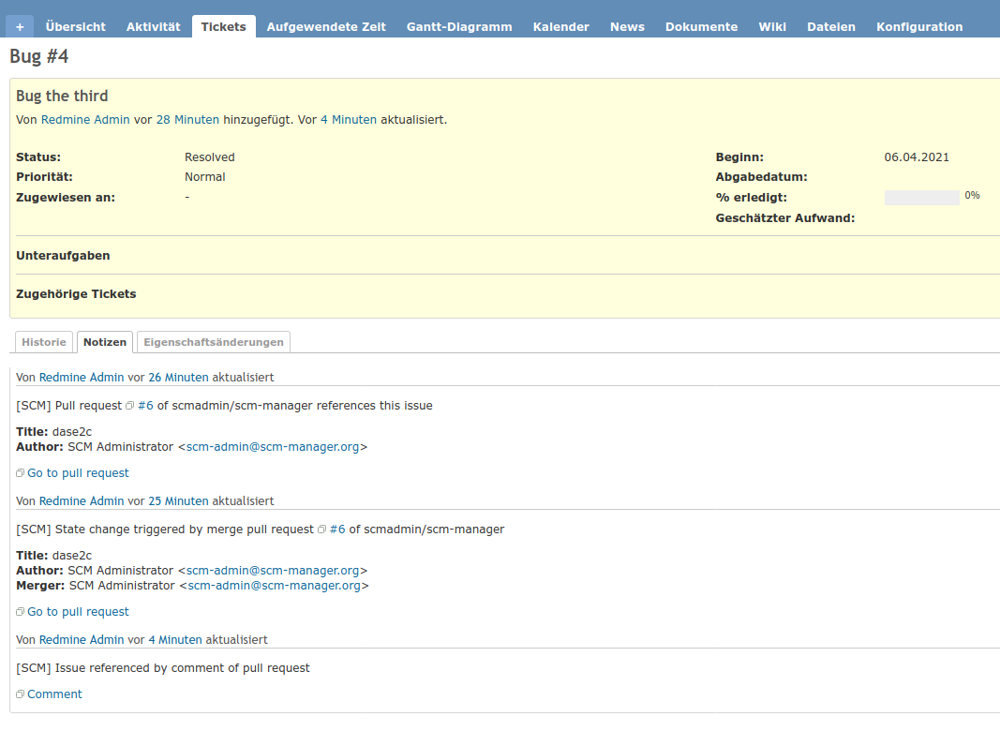

Falls das [Review Plugin](https://scm-manager.org/plugins/scm-review-plugin/) installiert ist, 
werden die Kommentar- und Statusübergangsfunktionen auf Pull Requests ausgeweitet. Das Plugin erkennt diese automatisch und es ist keine zusätzliche Konfiguration notwendig. 

Es ist egal, ob Tickets im Titel, der Beschreibung oder den Kommentaren eines Pull Requests stehen.

> **Wichtig**: Statusänderungen werden erst beim Mergen des PRs ausgeführt.

