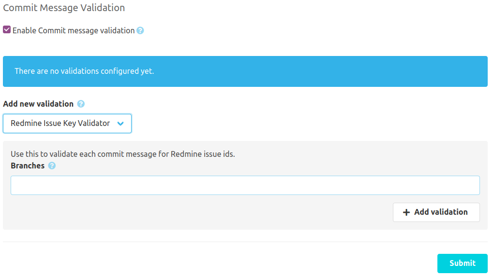

If the [SCM-Commit-Message-Checker-Plugin](https://scm-manager.org/plugins/scm-commit-message-checker-plugin/) is installed, 
the Redmine plugin will provide its own commit message issue key validator. 
This can be configured right on the commit message validation config.

# Validator config
The Redmine Issue Key Validator checks each commit for valid issue keys.
You may enable this validator only for a set of branches like `master,develop,feature/*`. Leave branches blank to validate every branch.
All new commits which does not contain a valid issue key will be rejected by the SCM-Manager. 

Example valid commit message: `New feature #42`
Example invalid commit message: `Bugfix`

