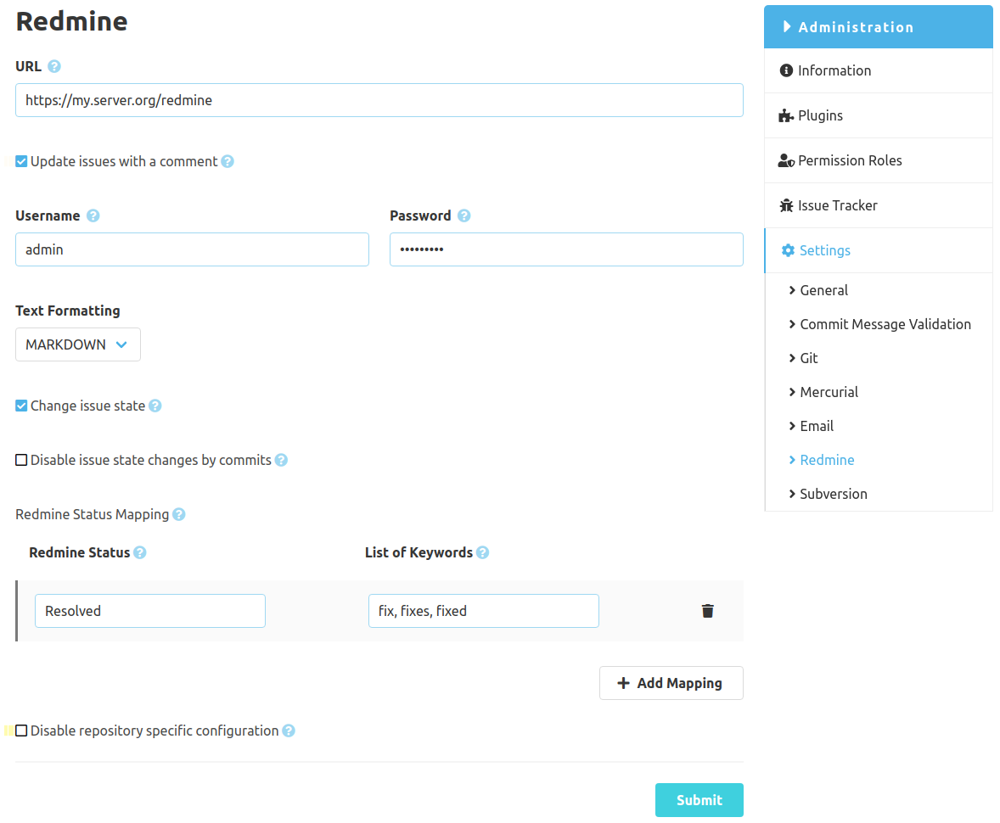

The SCM-Redmine-Plugin can be configured globally and repository specific. The global configuration is used for all repositories which doesn't have an specific config. The repository specific configuration can be disabled in the global config.

### Configuration form
To connect SCM-Manager with Redmine an instance url including the context path is required. Also credentials are mandatory which should belong to a technical Redmine user.
Afterwards you may already configure how the Redmine issues can be modified or updated. Using filters you can restrict the updates to specific projects or which project roles may see the comments. 

#### Update issue status
SCM-Manager searches for issue keys and status modification words in commit messages. If both are found in a message SCM-Manager changes the status of the Redmine issue.

#### Create comments
Comments will be created on the Jira issues, if a commit message contains the issue id.

Example commit message: "#492 fix user permissions bug."
With this example a comment with this commit message will be created for issue 492 and the issue will be updated to status "done".

