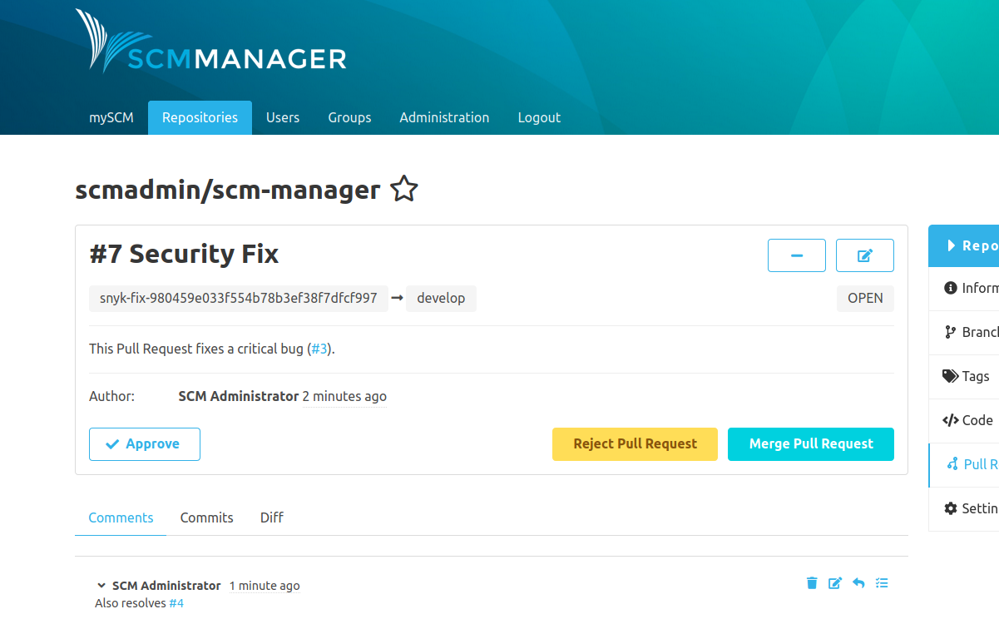
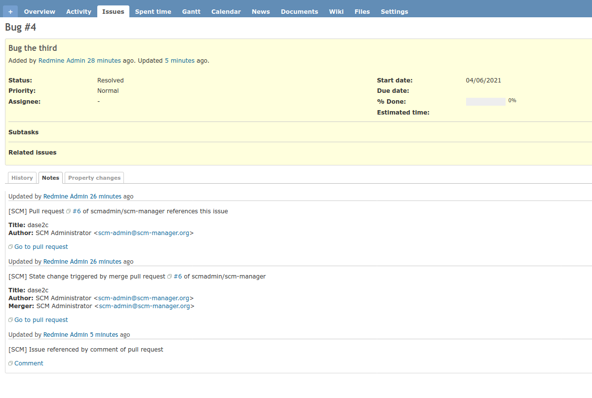

If the [Review Plugin](https://scm-manager.org/plugins/scm-review-plugin/) is installed,
the commenting and state-change features are expanded to include pull requests.
The plugin automatically recognizes these and there is no further configuration necessary.

It is not important whether the issue is mentioned in the title, description or comments of a pull request.

> **Important**: State changes are only executed once you merge the PR

